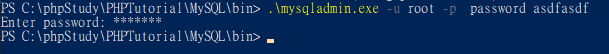

# 201912
##　更改 Mysql 用戶的密碼


```
 .\mysqladmin.exe -u root -p  password asdfasdf
```


## 2019-12-11 09:30:07

## 工具：cmder

**Reference**

介紹好用工具：Cmder \( 具有 Linux 溫度的 Windows 命令提示字元工具 \) \| The Will Will Web

[https://blog.miniasp.com/post/2015/09/27/Useful-tool-Cmder](https://blog.miniasp.com/post/2015/09/27/Useful-tool-Cmder)

## 2019-12-11 09:16:25

## PHP 使用 curl 應注意，須引入憑證檔案 cacert.pem

> php.ini

```text
[curl]
; A default value for the CURLOPT_CAINFO option. This is required to be an
; absolute path.
curl.cainfo =C:\phpStudy\cacert.pem
```

## 2019-12-09 15:01:30

[https://www.google.com/search?sxsrf=ACYBGNRldnh3zRsyEqRjICA-FACMl1NatA%3A1575869472612&source=hp&ei=INztXf60I-itmAWu-I7QBA&q=nginx&oq=nginx&gs\_l=psy-ab.3..35i39i19j35i39l2j0l7.2621312.2622343..2622605...6.0..0.53.228.5......0....1..gws-wiz.......0i131.rfLczm8aUe8&ved=0ahUKEwj-xICh66fmAhXoFqYKHS68A0oQ4dUDCAc&uact=5](https://www.google.com/search?sxsrf=ACYBGNRldnh3zRsyEqRjICA-FACMl1NatA%3A1575869472612&source=hp&ei=INztXf60I-itmAWu-I7QBA&q=nginx&oq=nginx&gs_l=psy-ab.3..35i39i19j35i39l2j0l7.2621312.2622343..2622605...6.0..0.53.228.5......0....1..gws-wiz.......0i131.rfLczm8aUe8&ved=0ahUKEwj-xICh66fmAhXoFqYKHS68A0oQ4dUDCAc&uact=5)

尚硅谷Nginx教程（2019发布）\_哔哩哔哩 \(゜-゜\)つロ 干杯~-bilibili

[https://www.bilibili.com/video/av68136734](https://www.bilibili.com/video/av68136734)

Nginx 與 apache 差別？ - iT 邦幫忙::一起幫忙解決難題，拯救 IT 人的一天

[https://ithelp.ithome.com.tw/questions/10188452](https://ithelp.ithome.com.tw/questions/10188452)

NGINXConfig 網頁伺服器 NGINX 設定檔產生器，依需求產生各種 conf 檔

[https://free.com.tw/nginxconfig/](https://free.com.tw/nginxconfig/)

NGINX Config \| DigitalOcean

[https://www.digitalocean.com/community/tools/nginx\#?0.path=/var/www/html/mytest&0.redirect=false&0.ipv4=8081&0.https=false&0.root=false&gzip=false](https://www.digitalocean.com/community/tools/nginx#?0.path=/var/www/html/mytest&0.redirect=false&0.ipv4=8081&0.https=false&0.root=false&gzip=false)

## 2019-12-08 21:34:26

> ## bash - How do I disable Git Credential Manager for Windows? - Stack Overflow

[https://stackoverflow.com/questions/37182847/how-do-i-disable-git-credential-manager-for-windows](https://stackoverflow.com/questions/37182847/how-do-i-disable-git-credential-manager-for-windows)

> ## .gitconfig

```text
[core]
  askpass=
```

