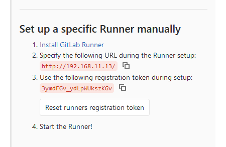

# Install Gitlab Runner on Linux

## Reference

[Install GitLab Runner manually on GNU/Linux | GitLab](https://docs.gitlab.com/runner/install/linux-manually.html)


```
sudo curl -L --output /usr/local/bin/gitlab-runner https://gitlab-runner-downloads.s3.amazonaws.com/latest/binaries/gitlab-runner-linux-amd64
```


**Simply download one of the binaries for your system:**
```
sudo chmod +x /usr/local/bin/gitlab-runner
```


**Give it permissions to execute:**
```
sudo useradd --comment 'GitLab Runner' --create-home gitlab-runner --shell /bin/bash
```

**Create a GitLab CI user:**
```
sudo gitlab-runner install --user=gitlab-runner --working-directory=/home/gitlab-runner
```

**Install and run as service:**
```
sudo gitlab-runner start
```

**Register the Runner**


```
sudo gitlab-runner register
```




> Please enter the gitlab-ci coordinator URL (e.g. https://gitlab.com )

```
http://192.168.11.13/
```

> Please enter the gitlab-ci token for this runner

```
3ymdFGv_ydLpWUkszKGv
```

> Please enter the gitlab-ci description for this runner

```
my-runner
```

> Please enter the gitlab-ci tags for this runner (comma separated):

```
my-tag,another-tag
```

> Please enter the executor: ssh, docker+machine, docker-ssh+machine, kubernetes, docker, parallels, virtualbox, docker-ssh, shell:

```
shell
```