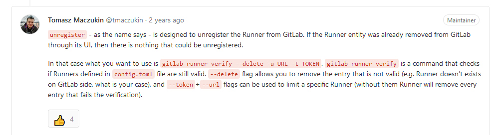

# Troubleshooting

## 解决win10 VirtualBox无法启动

### Reference

[042-解决win10 VirtualBox无法启动\(VERR\_NEM\_VM\_CREATE\_FAILED\) - 掘金](https://juejin.im/post/5d63869a51882559c41612c6)

### Solution

解决办法是禁用Hyper-V。

Win+R -&gt; cmd -&gt; Ctrl+Shift+Enter -&gt;

```text
bcdedit /set hypervisorlaunchtype off -> 重启电脑 -> 启动vbox
```

## 解決 gitlab runner 已被移除的問題

ERROR: Verifying runner... is removed

### Reference

[Unregistering a runner does not stop and/or uninstall the runner \(\#1316\) · Issues · GitLab.org / gitlab-runner · GitLab](https://gitlab.com/gitlab-org/gitlab-runner/issues/1316)

### Solution



```text
sudo gitlab-runner verify --delete
```

